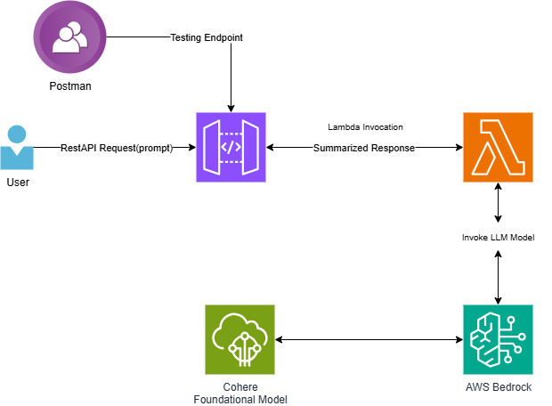

# Intelligent-Query-System-with-AWS-Bedrock-Integration
Architecture that uses Amazon Bedrock and other AWS services to process user queries, invoke foundation models, and return responses through an API endpoint. Designed for testing via Postman, with potential real-time interaction through a hosted API gateway.

# AWS Bedrock GenAI Use Case – API Gateway + Lambda + Cohere LLM

This project demonstrates how to build a serverless Generative AI application using:

- ✅ Amazon Bedrock (Cohere model)
- ✅ AWS Lambda for orchestration
- ✅ Amazon API Gateway to expose REST endpoint
- ✅ Input prompt + summarized response lifecycle

---

## 📊 Architecture Diagram



---

## 🚀 How it Works

1. The user sends a prompt via a REST API.
2. API Gateway routes the request to an AWS Lambda function.
3. The Lambda function invokes a foundational LLM hosted on Amazon Bedrock (e.g., Cohere or can be chosen).
4. The model responds with a summarized output, which is returned to the user.

---

## 🔧 Tech Stack

- **AWS Lambda**
- **Amazon Bedrock**
- **API Gateway**
- **Cohere Foundation Model**
- **Python (Boto3 SDK)**

---
This is a on-site log report of turbine breakdown.
Issue Log Date – 25-12-2023, Model Number – TB-CL-7882, Issue - Cracks appeared in the part MR 7882-9571
next to the rotor hub. The nut connecting the rotor blade to the rotor hub seems to be damaged. The
Anemometer readings seem to be within range. The electric braking seems to be unused. No indication of
damage to any other component of the turbine except normal wear and tear.
Potential Root Cause – Seems due to reduced tensile strength of the nut connecting the blade to the rotor.
Last Maintenance Date – 12-12-2023, Last Maintenance Issues Recorded - No known issues recorded and all
the parameters were within range.
Summarize the text in 2 lines.
## 🧪 Sample Prompt

```json
{"input_prompt": "This is a on-site log report of turbine breakdown. Issue Log Date – 25-12-2023, Model Number – TB-CL-7882, Issue - Cracks appeared in the part MR 7882-9571 next to the rotor hub. The nut connecting the rotor blade to the rotor hub seems to be damaged. The Anemometer readings seem to be within range. The electric braking seems to be unused. No indication of damage to any other component of the turbine except normal wear and tear. Potential Root Cause – Seems due to reduced tensile strength of the nut connecting the blade to the rotor. Last Maintenance Date – 12-12-2023, Last Maintenance Issues Recorded - No known issues recorded and all the parameters were within range. Summarize the text in 2 lines."}

## 🧪 Response
```json
{
    "statusCode": 200,
    "body": "\" The turbine model TB-CL-7882 experienced cracks due to reduced tensile strength of the nut connecting the blade, last maintenance was carried out with no issues.\""
}
